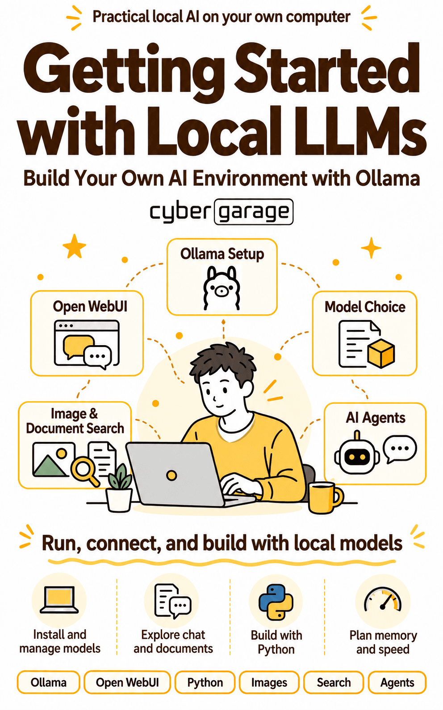

# Getting Started with Local LLMs

## Build Your Own AI Environment with Ollama

[Japanese](README.jp.md) | English

This is the companion sample repository for *Getting Started with Local LLMs: Build Your Own AI Environment with Ollama*, a beginner’s guide to running AI on your own computer.

The book takes you from installing Ollama and choosing a model to using local AI for conversations, images, document search, and AI agents. The Python examples in this repository let you try these ideas with small programs and sample materials.

**The English edition is now available on [Amazon Kindle](https://www.amazon.com/dp/B0HL2YBY4Q).**

<table>
  <tr>
    <td align="center">
      <a href="https://www.amazon.com/dp/B0HL2YBY4Q"></a>
    </td>
  </tr>
  <tr>
    <td align="center"><strong>Getting Started with Local LLMs</strong><br>Build Your Own AI Environment with Ollama<br><a href="https://www.amazon.com/dp/B0HL2YBY4Q">View the English Edition on Amazon</a></td>
  </tr>
</table>

## What you will learn

- Install Ollama and choose a model for your computer and tasks.
- Use local AI for conversations and document-based questions.
- Call Ollama from Python and have a model read images.
- Find relevant passages in your documents and use them to support answers with retrieval-augmented generation (RAG).
- Build an AI agent that calls tools to complete a task.
- Understand how memory, model size, and hardware affect your experience.

The book introduces the concepts and explains how to check the results. This repository provides the code and sample inputs for hands-on practice.

## Repository languages and book editions

The repository has separate runnable sample directories for each book edition. Run commands from the chosen language directory so relative image and document paths resolve correctly.

| Edition | Sample code |
| --- | --- |
| Japanese first edition | `ja/` on `main` |
| English edition | `en/` on `main`; chapter references below follow the English edition |

Chapter numbering differs between the existing Japanese README and the English edition. Use the table below for the English edition. Check the changelog if the repository behaves differently from your copy of the book.

## Get the samples

Clone the repository:

```console
git clone --depth 1 https://github.com/cybergarage/ollama-book-starter.git
cd ollama-book-starter/en
```

`--depth 1` downloads the latest files without the full commit history. To update a Git clone later, run `git pull` from the repository’s top-level folder.

If you do not use Git, select **Code → Download ZIP** on the [repository page](https://github.com/cybergarage/ollama-book-starter), extract the archive, and open a terminal in its `en` folder.

## Set up your environment

### 1. Install and start Ollama

Download Ollama from the [official download page](https://ollama.com/download), then install and start it.

### 2. Download the models

Run these commands in your terminal:

```console
ollama pull gemma4:e2b
ollama pull embeddinggemma
```

### 3. Create a Python environment

The samples require Python 3.9 or later. The Japanese edition records testing with Python 3.9 on macOS. The English sample code has been syntax checked but not run against a live Ollama server.

Run the following commands from `ollama-book-starter/en`.

On macOS or Linux:

```sh
python3 --version
python3 -m venv .venv
source .venv/bin/activate
python -m pip install -r requirements.txt
```

On Windows, in PowerShell:

```powershell
python --version
python -m venv .venv
.venv\Scripts\Activate.ps1
python -m pip install -r requirements.txt
```

Confirm that the version is 3.9 or later before creating the virtual environment. Activate `.venv` again whenever you open a new terminal to run the examples.

### 4. Check the setup

```console
python check_env.py
```

The English checker verifies the Python version, the `ollama` Python library, the local Ollama server, and the required models. Each successful check displays `[OK]`; a failed check displays `[NG]`. Its explanatory messages are in English.

Resolve any `[NG]` items and run the checker again. An all-OK result confirms these setup checks, but does not guarantee that every sample will run: the checker does not verify every dependency or input file.

## Run your first sample

With Ollama running and the virtual environment activated, run:

```console
python chat/hello.py
```

**Always run examples from `ollama-book-starter/en`.** Moving into a subfolder before running a script can break relative paths to sample images and documents.

Model responses can vary between runs. Check the result against your prompt and source materials rather than expecting an exact match with the book.

## Samples and English chapters

Folder names describe their topics rather than chapter numbers, so they can stay the same when the book’s organization changes.

| Folder | English edition chapter |
| --- | --- |
| `chat/` | Chapter 6: Use Ollama from Python |
| `vision/` | Chapter 7: Have a model read images |
| `rag/` | Chapter 8: Supplement knowledge with search |
| `agent/` | Chapter 9: Build an AI agent |
| `hardware/` | Chapter 10: Choose a computer for comfortable use |

From the repository root, sample images are in `en/vision/images/`, and sample documents are in `en/rag/documents/`. The supplied receipt photo contains Japanese text; the English program asks for an English answer. The `en/coding/` folder is included for parity with the Japanese edition; the English edition does not have a separate corresponding chapter.

## Troubleshooting

Start with:

```console
python check_env.py
```

- **Python version check fails:** use Python 3.9 or later to create the virtual environment.
- **The Ollama library is missing:** activate `.venv` and run `python -m pip install -r requirements.txt`.
- **The Ollama server is unreachable:** make sure Ollama is running, then repeat the check.
- **A model is missing:** run the corresponding `ollama pull` command listed above.
- **An image or document cannot be found:** return to the repository’s top-level folder before running the script.

If all checks pass but a sample still fails, read that sample’s error message for missing dependencies or input files.

## Changelog

This table records changes to the sample repository.

| Date | Change |
| --- | --- |
| 2026-09-12 | Lowered the minimum Python version from 3.10 to 3.9 after testing on macOS with Python 3.9. |

## Get the book

Get [Getting Started with Local LLMs: Build Your Own AI Environment with Ollama on Amazon Kindle](https://www.amazon.com/dp/B0HL2YBY4Q).

## License

The sample code and accompanying documents are available under the [MIT License](LICENSE).
